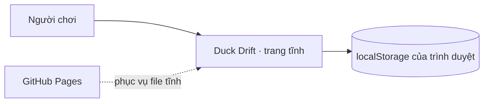
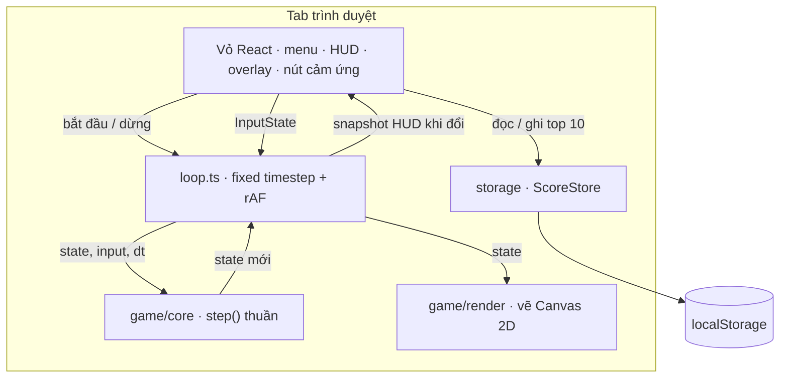

# Kiến trúc

> **Trả lời:** Hệ thống ghép lại thế nào, ranh giới giữa các phần ở đâu?
> **Trạng thái:** 🟢 đủ
> **Cập nhật:** 2026-09-04 · commit —
> **Cập nhật khi:** thêm/bỏ một module hoặc service · đổi cách hai module nói chuyện

## 1. Context — hệ thống nằm giữa ai với ai

Không có backend, không có dịch vụ ngoài lúc chạy. Toàn bộ trạng thái nằm trong tab của người chơi.

## 2. Container — hệ thống gồm những khối chạy được nào

Chú ý chiều mũi tên giữa `Loop` và `React`: React đẩy input **vào**, và chỉ nhận **snapshot HUD** ra — không nhận `GameState`. Đó là bất biến #8.

## 3. Module và ranh giới

| Module          | Trách nhiệm một câu                                                | Được phép gọi               | **Không** được gọi                                         |
| --------------- | ------------------------------------------------------------------ | --------------------------- | ---------------------------------------------------------- |
| `game/core`     | Toàn bộ luật chơi, dưới dạng hàm thuần trên `GameState`            | chính nó                    | React, DOM, `window`, `Math.random`, `Date.now`, `storage` |
| `game/render`   | Vẽ một `GameState` lên `CanvasRenderingContext2D`                  | `game/core` (chỉ đọc types) | mọi thứ sửa state                                          |
| `game/loop`     | Gom thời gian thật thành các bước 1/60s, gọi `step` rồi gọi `draw` | `game/core`, `game/render`  | React                                                      |
| `input`         | Đổi sự kiện bàn phím và chạm thành một `InputState` duy nhất       | DOM events                  | `game/core`                                                |
| `storage`       | Đọc/ghi top 10 qua interface `ScoreStore`                          | `localStorage`              | `game/core`                                                |
| `components`    | Mọi thứ hiện ra ngoài canvas                                       | `hooks`, `storage`, `input` | `game/core` trực tiếp                                      |
| `hooks/useGame` | Cây cầu duy nhất: dựng loop, bơm input vào, phát snapshot HUD ra   | tất cả các module trên      | —                                                          |

## 4. Luồng dữ liệu của đường đi quan trọng nhất

Một frame, kể từ khi người chơi bấm phím:

1. `input/keyboard.ts` (hoặc `touch.ts`) cập nhật một object `InputState` dùng lại — không tạo object mới mỗi sự kiện.
2. `requestAnimationFrame` gọi `loop.tick(now)`. Loop tính thời gian trôi qua, **clamp ở 0.25s**, cộng vào accumulator.
3. Chừng nào accumulator ≥ 1/60: gọi `step(state, input, 1/60)`, trừ accumulator. Có thể chạy nhiều bước trong một frame.
4. `step` chạy theo thứ tự cố định: đọc input → cập nhật tàu → cập nhật đạn → cập nhật thiên thạch và UFO → cập nhật power-up → va chạm → tính điểm → sinh wave mới nếu hết thiên thạch → cập nhật particle.
5. `draw(ctx, state)` vẽ một lần cho mỗi frame, không phải mỗi bước.
6. Loop tính snapshot HUD `{ lives, score, wave, weapon, weaponMsLeft, shield }`. **So sánh nông với snapshot trước**; chỉ khi khác mới gọi callback để React re-render.
7. Khi `state.phase` chuyển sang `gameover`, `useGame` gọi `ScoreStore` để hỏi thứ hạng và quyết định có hiện ô nhập tên hay không.

## 5. Tech stack

| Lớp            | Công nghệ                                 | Biện minh |
| -------------- | ----------------------------------------- | --------- |
| Khung ứng dụng | Next.js 15 App Router, `output: export`   | ADR-0001  |
| UI             | React 19 · TypeScript 5 · Tailwind CSS 3  | ADR-0001  |
| Vẽ game        | Canvas 2D API, không thư viện             | ADR-0002  |
| Vòng lặp       | Fixed timestep 60Hz tự viết               | ADR-0003  |
| Lưu điểm       | `localStorage` sau interface `ScoreStore` | ADR-0006  |
| Test           | Vitest + happy-dom + Testing Library      | ADR-0001  |
| Quản lý gói    | pnpm 10.x                                 | ADR-0001  |
| Design tokens  | `docs/design-system/asteroids/MASTER.md`  | ADR-0007  |
| E2E            | Playwright, 5 cấu hình, chạy trên `out/`  | ADR-0008  |
| CI             | GitHub Actions, hai job song song         | ADR-0008  |
| Hosting        | GitHub Pages, publish từ workflow         | ADR-0008  |
| Phát hành      | Tag và note suy từ lịch sử commit         | ADR-0009  |

ADR-0001 chọn Yarn classic cho phần quản lý gói; cả thư mục `web-game/` đã chuyển
sang pnpm 10 sau đó. ADR giữ nguyên như đã viết — nó là bản ghi của quyết định lúc đó.
